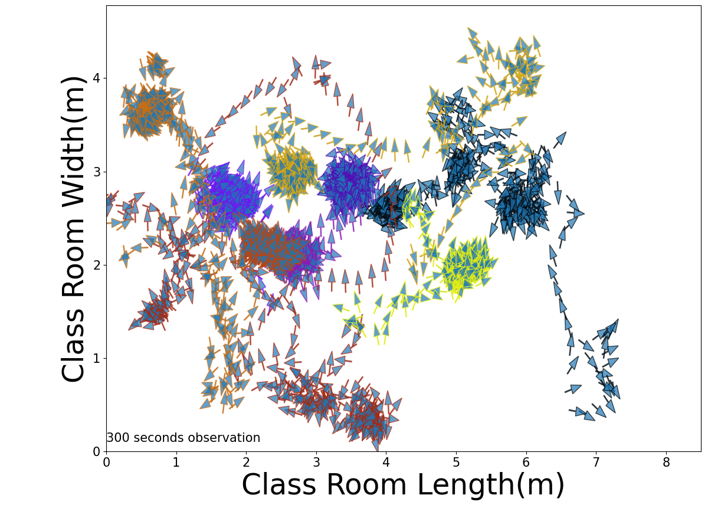
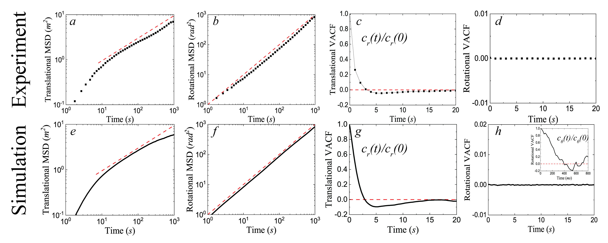

# dynamics-simulations-of-human-movement
OVERVIEW OF THR PROJECT

the project aims to understand the fundamental dynamics of human movement, and proposes a model to capture several important features of human movement.

The mechanisms of human movement are very complicated, there is no general rule of thumb that explains what's happening in real work. However, based on the real-observed data in preschool classrooms, we do find some general patterns that can be helpful to understand the mechanism and build an explainable model.

      1.distances between children in the classroom are not randomly distributed. Data shows that children tend to interact with others at a "comfortable" distance, and radial distribution function g(r) indicates a peak around this particular distance.

      2.relative orientations of children and their partners are not randomly distributed. Data also shows that children tend to be oriented in a "shoulder-to-shoulder" way when the distance between is short. Whereas children are more likely to be oriented in a "face-to-face" way at a relatively larger distance.

Based on the above-observed patterns, we build a model that assumes children behave as ferromagnets at a short distance, while antiferromagnets at a relatively larger distance. The results show this model well captures several feathers of human movement.

REAL DATA VISUALIZATION

   1.data collection\
      Radio Frequency Identification technology (RFID)vallows for efficient capture of each child’s location and movement throughout the classroom and informs our understanding of which children tend to be in proximity of each other.        
      
\
<em>Figure 1. continuous measurement of real human locations and orientations </em>

Figure 1 shows the trajectories of the nine children for 300 seconds during one period of class time. Using tags worn by children, we can also find orientation for each kid data collection. The arrow represents the orientation of the child. We find that the children are not uniformly walking/running the whole classroom space, they wander in a small area for a certain amount of time when they are interacting with other children in social contact, the motions are trapped by localization.  For instance, once children were approaching others (see several clusters in this center of Fig. 1, each cluster shows a trajectory of a child),  children kept roaming around for a while.\

To quantify the size of the cluster we measure mean square displacement (MSD) for translational and rotational directions, respectively (see Fig. 2 a&b). Figure 2a plots the translational MSD  with time, finding that a normal diffusion  for short time scale t<tc~10seconds. For a large time scale, we find a subdiffusion with 0.5. The typical time scale tc10 characterizes the size of clusters ~1-2m.  In contrast, the rotational MSD shows a normal diffusion (Fig 2b). The sublinearity of the MSD in the translational motions suggests a strong memory effect (long-range time correlation) of the children’s movement, resulting in a longer waiting time in particular areas of the classroom, whereas no such effect is observed in terms of orientations.

\
<em>Figure 1. continuous measurement of real human locations and orientations </em>
